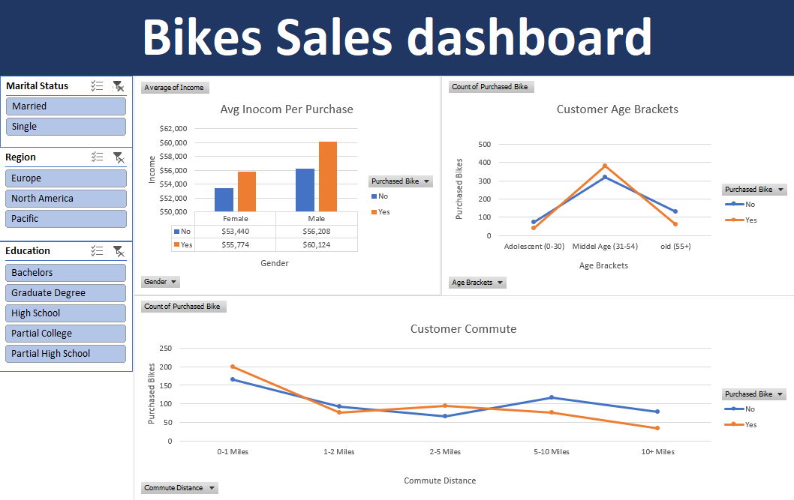

# Excel-Bikes-Sales-Project
A data analysis project exploring factors influencing bike purchases using Excel. Analyzed customer demographics, income levels, and other variables to identify purchase patterns that is in interactive dashboard

##   🌟Features

- 📊 **Interactive Dashboard**  
  - Sales breakdown by Marital Status, Region, Education
  - Dynamic charts that update with slicers

- 📉 **Pivot Tables & Charts**  
  - Summarize large data sets efficiently  
  - Visualize trends and comparisons

- 🧹 **Data Cleaning & Formatting**  
  - Organized dataset with meaningful column headers  
  - Removed duplicates and corrected inconsistencies
  - age Segmentaed into age brackets

- 📈 **KPIs & Metrics**    
  - Purchased Bikes
  - Avg Inocom of Customer 
  - Customer Commute Distance
  - Customer Age Brackets

## 📊Dashboard
 

## 🛠️How to Use
1. Open the file [Excel_Bikes_Sales_Project](Excel_Bikes_Sales_Project.xlsx)
2. Go to the **Dashboard** sheet to explore the visual summary
3. Use the **slicers** to filter data by Marital Status, Region, Education
4. Review the **Wokring sheet**, **Row Data** , **Pivot Tables**  sheets to see the backend logic and structure

## 🔍Key Findings
- Middel aged customers (31-54) were most likely to purchase bikes
- Higher income brackets showed increased purchase rates
- Customer of Commute Distance (0-1) miles are most likely to purchase bikes
- Femals in Europe ara most likly to not purchase bikes
 
## 🧠Skills Demonstrated
- Data Cleaning and Preparation  
- Pivot Tables & Pivot Charts  
- Dashboard Design  
- Excel Formulas (`Nested IF`,`SUMIF`, `COUNTIF`, `AVERAGE`,etc.)  
- Data Visualization  
- Use of Slicers and Interactivity
